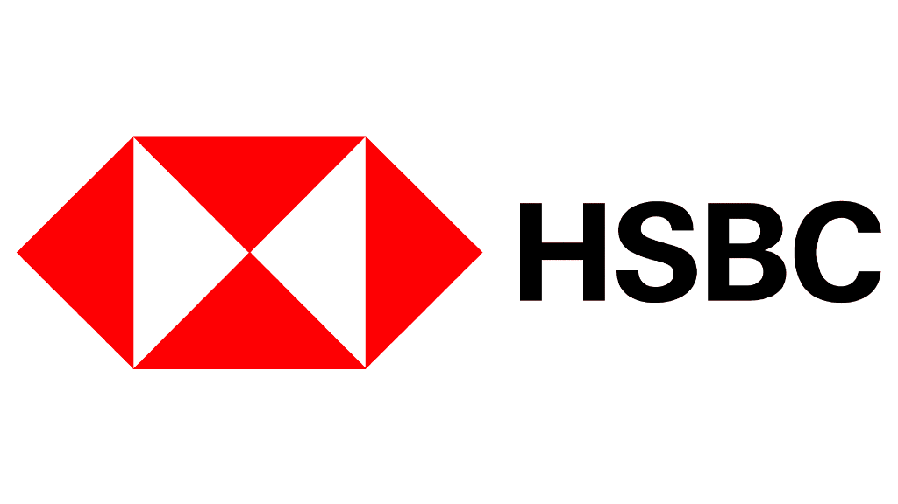
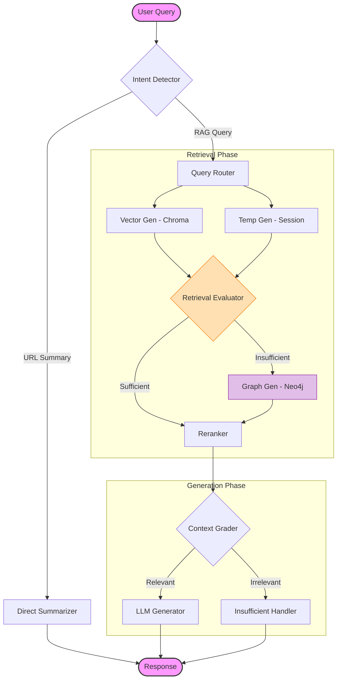

# BOI Agentic GraphRAG System

<div align="center">



**A Next-Generation Agentic Knowledge System for HSBC BOI**

[](./backend)
[](./frontend)
[](./data)

</div>

## 📖 Introduction

**GTS GraphRAG** is an advanced, local-first knowledge retrieval system designed to bridge the gap between unstructured documentation and structured architectural knowledge. Unlike traditional RAG systems that rely solely on vector similarity, this system employs a **Hybrid Agentic Workflow** that combines:

1.  **Vector Search**: Fast, semantic retrieval from ChromaDB.
2.  **GraphRAG**: Deep, multi-hop reasoning using Neo4j knowledge graphs.
3.  **Agentic Orchestration**: A smart LangGraph agent that evaluates retrieval sufficiency and dynamically routes queries.

Designed for **HSBC BOI (Business Operating Interface)** knowledge transfer, it provides traceability, accuracy, and deep contextual understanding of technical ecosystems.

---

## 🌟 Key Features

### 🧠 Intelligent Agent Workflow
- **Sequential Retrieval Pattern**: "Vector First" approach to minimize latency. The agent checks vector results first; if insufficient, it triggers a deep graph traversal.
- **Self-Correction**: An LLM-based evaluator (`Retrieval Evaluator`) judges the quality of retrieved context before answering.
- **Intent Detection**: Automatically distinguishes between general questions and specific URL summarization tasks.

### 🕸️ Knowledge Graph Power
- **Neo4j Integration**: Maps entities (Microservices, APIs, Teams) and their relationships.
- **Hybrid Search**: Merges vector similarity with graph connectivity for superior answer quality.

### ⚡ Modern Conversational UI
- **Streaming Responses**: Real-time token streaming with collapsible "Thought Process" steps.
- **Rich Markdown**: Support for tables, code blocks, and source citations.
- **Confluence Integration**: Direct ingestion of Confluence pages via URL.

---

## 🏗️ Architecture

The system is built on a **Microservices-ready** architecture using Python (Backend) and TypeScript (Frontend).

### Retrieval Pipeline (Mermaid)



### Technology Stack

| Component | Technology | Description |
|-----------|------------|-------------|
| **Orchestration** | **LangGraph** | Cyclic stateful agent workflows |
| **Backend API** | **FastAPI** | High-performance Async IO |
| **Vector Store** | **ChromaDB** | Semantic embeddings storage |
| **Graph Store** | **Neo4j** | Knowledge graph & relationship mapping |
| **Frontend** | **Next.js 14** | React Server Components & Streaming UI |
| **Styling** | **Tailwind CSS** | HSBC-compliant styling system |
| **LLM** | **Qwen-Plus** | High-performance generation (via DashScope) |

---

## 🚀 Getting Started

### Prerequisites

1.  **Python 3.11+** (Managed via `uv` recommended)
2.  **Node.js 18+** & npm
3.  **Neo4j Instance**:
    *   Docker: `docker run -p 7474:7474 -p 7687:7687 neo4j`
    *   Or Neo4j Desktop / Aura.

### 🛠️ Installation

#### 1. Backend Setup

```bash
# 1. Clone the repository
git clone https://github.com/coin1860/gts-graph-rag.git
cd gts-graph-rag

# 2. Install Python dependencies (using uv for speed)
uv sync

# 3. Configure Environment
cp .env.example .env
# ⚠️ Edit .env and add your DASHSCOPE_API_KEY and NEO4J_CREDENTIALS
```

#### 2. Frontend Setup

```bash
cd frontend

# 1. Install dependencies
npm install

# 2. Run development server
npm run dev
```

### ▶️ Running the System

1.  **Start Backend**:
    From the root directory:
    ```bash
    uv run python -m backend.server
    ```
    *API documentation available at: http://localhost:8000/docs*

2.  **Start Frontend**:
    From `frontend/` directory:
    ```bash
    npm run dev
    ```
    *Access the UI at: http://localhost:3000*

---

## 📚 Usage Guide

### Chat Interface
- **Ask Questions**: Type natural language queries about the BOI system.
- **Check Reasoning**: Click the `▶` arrow on any agent step (e.g., `[graph_retriever]`) to see the internal logic and retrieved data.
- **Custom Prompt**: Use the collapsible "Custom Prompt" section to override the system persona for specific queries.

### Admin Dashboard (`/admin`)
- **Document Management**: Upload PDFs, Text files, or ingest Confluence URLs.
- **Graph Visualization**: View the underlying knowledge graph nodes and edges.
- **User Management**: Manage system access roles.

---

## 🧪 Development

### Project Structure

```
gts-graph-rag/
├── backend/
│   ├── agent/          # LangGraph Workflow definitions (nodes, graph.py)
│   ├── ingestion/      # ETL Pipelines for PDF/Confluence -> Graph/Vector
│   ├── models/         # LLM & Embedding Model Wrappers
│   └── routers/        # FastAPI Endpoints
├── frontend/
│   ├── src/app/chat/   # Main Chat Interface (Client Components)
│   ├── src/app/admin/  # Admin Dashboard
│   └── globals.css     # Global Styles (HSBC Red Theme)
└── data/               # Local data storage (Chroma, Uploads)
```

### Running Tests

```bash
# Run backend unit tests
uv run pytest tests/
```

---

## 🤝 Contributing

1.  Fork the repository.
2.  Create a feature branch (`git checkout -b feature/amazing-feature`).
3.  Commit your changes (`git commit -m 'Add amazing feature'`).
4.  Push to the branch.
5.  Open a Pull Request.

---

**© 2025 GTS GraphRAG Team** | Internal Use Only

